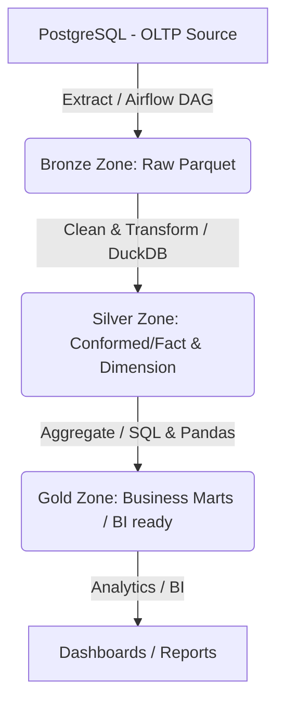

# Toy Store End-to-End Data Lakehouse Pipeline

Dự án này xây dựng một hệ thống **Data Lakehouse** hoàn chỉnh (End-to-End) phục vụ việc phân tích dữ liệu cho cửa hàng đồ chơi (**Toy Store**). Hệ thống tự động thu thập dữ liệu từ cơ sở dữ liệu giao dịch PostgreSQL (OLTP), lưu trữ dưới dạng hồ dữ liệu cục bộ (Local Data Lake) theo kiến trúc Medallion (Bronze -> Silver -> Gold), và phân tích/biến đổi dữ liệu thông qua DuckDB và Apache Airflow.

---

## 🗺️ Kiến trúc hệ thống (Medallion Architecture)



1. **Source**: Cơ sở dữ liệu PostgreSQL lưu trữ thông tin sản phẩm, đơn hàng, khách hàng.
2. **Bronze (Raw Zone)**: Dữ liệu được trích xuất nguyên bản từ PostgreSQL sang định dạng file **Parquet** nén đặt tại `data/bronze/`.
3. **Silver (Cleaned/Conformed)**: Dữ liệu được làm sạch (xử lý null, chuẩn hóa kiểu dữ liệu, định dạng ngày tháng) đặt tại `data/silver/`.
4. **Gold (Business/Curated)**: Dữ liệu được tổng hợp thành các bảng Fact và Dimension (mô hình hình sao) sẵn sàng cho việc phân tích và trực quan hóa đặt tại `data/gold/`.
5. **Orchestrator**: **Apache Airflow** điều phối toàn bộ vòng đời của dữ liệu từ trích xuất đến biến đổi.
6. **Compute Engine**: **DuckDB** được sử dụng để truy vấn hiệu năng cao trực tiếp trên các file Parquet mà không cần thiết lập hệ quản trị cơ sở dữ liệu trung gian.

---

## 📁 Cấu trúc thư mục dự án

```text
toy_store_end_to_end/
├── config/                  # Cấu hình hệ thống & Kết nối database
├── dags/                    # Nơi chứa các Apache Airflow DAGs
├── data/                    # Nơi lưu trữ dữ liệu (Data Lakehouse)
│   ├── bronze/              # Dữ liệu thô (Raw Parquet)
│   ├── silver/              # Dữ liệu đã làm sạch (Cleaned Parquet)
│   └── gold/                # Dữ liệu tổng hợp (Analytical Parquet)
├── etls/                    # Các scripts xử lý dữ liệu (Extract, Transform, Load)
├── logs/                    # Logs hệ thống của Airflow
├── pipelines/               # Các luồng xử lý hoặc code bổ trợ nâng cao
├── utils/                   # Các hàm tiện ích (kết nối DB, gửi mail, logging...)
├── Dockerfile               # Dockerfile cho Airflow & các service
├── docker-compose.yml       # Cấu hình container chạy Airflow, PostgreSQL
├── airflow.env              # Biến môi trường cho Apache Airflow
└── requirements.txt         # Các thư viện Python cần cài đặt
```

---

## 🛠️ Hướng dẫn cài đặt và chạy dự án

### 1. Yêu cầu hệ thống
* Python 3.10+
* PostgreSQL (hoặc chạy qua Docker)
* Docker & Docker Compose (tùy chọn)

### 2. Khởi tạo môi trường ảo (Virtual Environment)
Mở terminal tại thư mục gốc của dự án và chạy các lệnh sau:

* **Trên Windows:**
  ```bash
  python -m venv venv
  venv\Scripts\activate
  ```

* **Trên macOS/Linux:**
  ```bash
  python3 -m venv venv
  source venv/bin/activate
  ```

### 3. Cài đặt các thư viện Python
Cài đặt toàn bộ các thư viện cần thiết trong file `requirements.txt`:
```bash
pip install -r requirements.txt
```

### 4. Cấu hình biến môi trường
Tạo hoặc chỉnh sửa các biến kết nối database trong file `airflow.env`:
```env
DB_USER=postgres
DB_PASSWORD=your_password
DB_HOST=localhost
DB_PORT=5432
DB_NAME=toy_store
```

---

## 🚀 Quy trình chạy Pipeline dữ liệu

1. **Khởi động Apache Airflow**:
   Khởi chạy môi trường Airflow độc lập bằng lệnh:
   ```bash
   airflow standalone
   ```
   *Truy cập giao diện Web UI tại địa chỉ `http://localhost:8080` bằng tài khoản được cấp trên terminal.*

2. **Kích hoạt DAGs**:
   Bật DAG `postgres_to_lakehouse_dag` trên giao diện Airflow để tự động kích hoạt luồng dữ liệu hoặc trigger chạy thủ công.

3. **Truy vấn phân tích dữ liệu**:
   Bạn có thể sử dụng DuckDB để viết các phân tích ad-hoc cực nhanh:
   ```python
   import duckdb
   con = duckdb.connect()
   # Truy vấn trực tiếp từ file Parquet
   df = con.execute("SELECT * FROM 'data/bronze/orders/*.parquet' LIMIT 5").df()
   print(df)
   ```