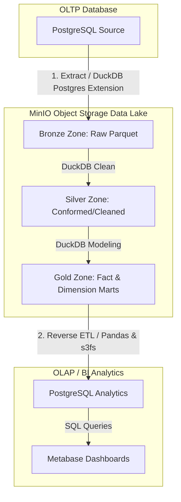

# Toy Store End-to-End Data Lakehouse Pipeline

Dự án này xây dựng một hệ thống **Data Lakehouse** hoàn chỉnh (End-to-End) phục vụ việc phân tích dữ liệu cho cửa hàng đồ chơi (**Toy Store**). 

Hệ thống tự động thu thập dữ liệu từ cơ sở dữ liệu giao dịch PostgreSQL (OLTP), lưu trữ dưới dạng hồ dữ liệu **MinIO S3 Object Storage** theo kiến trúc Medallion (Bronze -> Silver -> Gold), thực hiện các phép biến đổi SQL hiệu năng cao qua **DuckDB**, tự động điều phối qua **Apache Airflow**, và cuối cùng nạp ngược lại dữ liệu đã tổng hợp về PostgreSQL (Reverse ETL) để phục vụ trực quan hóa trên **Metabase**.

---

## 🗺️ Kiến trúc hệ thống (Medallion Architecture)



1. **PostgreSQL Source (OLTP)**: Lưu trữ các bảng staging giao dịch và hoạt động của Toy Store.
2. **Bronze Zone (Raw)**: Dữ liệu thô trích xuất nguyên bản từ Postgres sang định dạng file **Parquet** đặt tại bucket MinIO `s3://toy-store-lakehouse/bronze/`.
3. **Silver Zone (Cleaned/Conformed)**: Dữ liệu được chuẩn hóa cột `created_at`, ép kiểu dữ liệu chuẩn, xử lý khoảng trắng và điền giá trị mặc định cho các trường null đặt tại bucket MinIO `s3://toy-store-lakehouse/silver/`.
4. **Gold Zone (Business/Curated)**: Dữ liệu được tổ chức theo mô hình hình sao (Star Schema) gồm Fact, Dimension và các bảng báo cáo tổng hợp (Marts) đặt tại bucket MinIO `s3://toy-store-lakehouse/gold/`.
5. **PostgreSQL Analytics (OLAP)**: Nhận dữ liệu tổng hợp từ tầng Gold phục vụ các truy vấn phân tích (Reverse ETL).
6. **Metabase**: Kết nối tới PostgreSQL để xây dựng báo cáo và Dashboard.
7. **Apache Airflow**: Điều phối tự động toàn bộ quy trình chạy tuần tự.

---

## 🛠️ Công nghệ sử dụng (Tech Stack)

* **Orchestrator**: Apache Airflow 3.x (chạy trong Docker Container)
* **Object Storage (Data Lake)**: MinIO (tương thích giao thức Amazon S3)
* **Compute Engine**: DuckDB 1.x (xử lý dữ liệu in-memory hiệu năng cao trực tiếp trên file Parquet qua giao thức S3)
* **Database**: PostgreSQL 15 (chứa cả dữ liệu nguồn giao dịch và dữ liệu đích phân tích)
* **BI Tool**: Metabase
* **Language & Libraries**: Python 3.12, Pandas, SQLAlchemy, PyArrow, S3FS, Boto3

---

## 📁 Cấu trúc thư mục dự án

```text
toy_store_end_to_end/
├── dags/                    # Chứa Apache Airflow DAGs để điều phối pipeline
│   └── toy_store_lakehouse_dag.py
├── data/                    # Thư mục dữ liệu local (được mount vào container)
├── etls/                    # Scripts xử lý dữ liệu (Extract, Transform, Load)
│   ├── extract_postgres.py  # Trích xuất dữ liệu: Postgres -> MinIO Bronze (sử dụng DuckDB)
│   ├── transform_duckdb.py  # Biến đổi dữ liệu: Bronze -> Silver -> Gold trên MinIO bằng DuckDB
│   └── load_gold_to_postgres.py # Nạp dữ liệu: MinIO Gold -> Postgres (Reverse ETL với Zero-Downtime)
├── logs/                    # Chứa log hoạt động của các dịch vụ Airflow
├── pipelines/               # Thư mục trống dùng cho mở rộng các pipeline khác
├── utils/                   # Các tiện ích kết nối và cấu hình hệ thống
│   ├── db_connector.py      # Cung cấp SQLAlchemy engine kết nối database
│   ├── init_postgres_data.py # Khởi tạo bảng staging và nạp dữ liệu mẫu nguồn
│   └── inspect_db.py        # Tiện ích kiểm tra cấu trúc bảng database
├── tests/                   # Kiểm thử dữ liệu
│   └── test_data.py         # Kiểm tra kết nối MinIO và cấu trúc dữ liệu thô
├── config/                  # Thư mục chứa file cấu hình dự án
├── venv/                    # Môi trường ảo Python chạy local
├── Dockerfile               # Cấu hình đóng gói môi trường Airflow
├── docker-compose.yml       # Điều phối các container Airflow, Postgres, MinIO, Metabase
├── airflow.env              # Biến môi trường khi chạy các tập lệnh Python ở máy local
└── requirements.txt         # Các thư viện Python phục vụ dự án
```

---

## 🚀 Hướng dẫn cài đặt và khởi chạy chi tiết

### 1. Khởi động các dịch vụ bằng Docker Compose
Dự án chạy hoàn toàn thông qua Docker Compose. Chạy lệnh sau tại thư mục gốc:

```bash
docker-compose up --build -d
```

Lệnh này sẽ khởi chạy 5 container:
* **PostgreSQL** (`postgres_source_db`): Cổng `5432` (lưu trữ database `toy_store_db`)
* **MinIO Storage** (`minio_storage`): Cổng `9000` (API S3) và `9001` (Giao diện Web Console)
* **MinIO Creator** (`minio_bucket_creator`): Container chạy một lần để tự động tạo bucket `toy-store-lakehouse`
* **Apache Airflow** (`airflow_app_container`): Cổng `8080` (Web UI của Airflow)
* **Metabase** (`metabase_container`): Cổng `3000` (Giao diện BI Dashboard)

---

### 2. Khởi tạo dữ liệu mẫu (Seeding)
Sau khi PostgreSQL khởi động thành công, bạn cần chạy script để tạo các bảng giao dịch nguồn và nạp dữ liệu mẫu. Có hai cách thực hiện:

#### Cách A: Chạy từ máy local (Yêu cầu Python cục bộ)
```bash
# Thiết lập encoding UTF-8 (đối với Windows PowerShell) để tránh lỗi ký tự tiếng Việt
$env:PYTHONIOENCODING="utf-8"

# Cài đặt thư viện
pip install -r requirements.txt

# Khởi tạo dữ liệu
python utils/init_postgres_data.py
```

#### Cách B: Chạy trực tiếp bên trong Container (Khuyên dùng)
```bash
docker exec -it airflow_app_container python utils/init_postgres_data.py
```

Bạn có thể kiểm tra cấu trúc các bảng đã được khởi tạo trong Postgres bằng cách chạy:
```bash
docker exec -it airflow_app_container python utils/inspect_db.py
```

---

### 3. Vận hành Pipeline dữ liệu

#### Cách A: Chạy tự động qua Airflow Web UI (Khuyên dùng)
1. Truy cập giao diện quản trị Airflow tại địa chỉ: [http://localhost:8080](http://localhost:8080).
2. Thông tin đăng nhập mặc định:
   - **Username**: `admin`
   - **Password**: Tìm trong log khởi động của container bằng lệnh:
     ```bash
     docker logs airflow_app_container 2>&1 | grep "Password for user"
     ```
3. Tìm kiếm DAG có tên là `toy_store_lakehouse_pipeline`.
4. Bật (Toggle Active) DAG và nhấn nút **Trigger DAG** để bắt đầu chạy pipeline. Toàn bộ quy trình từ trích xuất -> làm sạch -> tổng hợp -> nạp ngược lại Postgres phân tích sẽ được tự động thực thi tuần tự.

#### Cách B: Chạy thủ công từng bước qua dòng lệnh
Bạn có thể kích hoạt tuần tự từng giai đoạn bằng cách chạy các lệnh sau:

```bash
# Bước 1: Trích xuất Postgres -> MinIO Bronze (S3 Parquet)
docker exec -it airflow_app_container python etls/extract_postgres.py

# Bước 2: Biến đổi dữ liệu Bronze -> Silver -> Gold trên MinIO (S3 Parquet)
docker exec -it airflow_app_container python etls/transform_duckdb.py

# Bước 3: Reverse ETL từ MinIO Gold -> Postgres OLAP (Sử dụng kỹ thuật Truncate & Insert để tránh gián đoạn BI)
docker exec -it airflow_app_container python etls/load_gold_to_postgres.py
```

---

### 4. Kiểm tra dữ liệu trên MinIO Console
Để kiểm tra các file Parquet đã được đẩy lên hồ dữ liệu thành công hay chưa:
1. Truy cập địa chỉ: [http://localhost:9001](http://localhost:9001)
2. Thông tin đăng nhập:
   - **Username**: `minio_admin`
   - **Password**: `minio_password`
3. Chọn mục **Object Browser** -> truy cập vào bucket `toy-store-lakehouse` để thấy 3 phân vùng Medallion: `bronze/`, `silver/`, và `gold/`.

---

### 5. Kết nối và xây dựng Dashboard trên Metabase
1. Truy cập Metabase tại địa chỉ: [http://localhost:3000](http://localhost:3000).
2. Tạo tài khoản quản trị ban đầu.
3. Thêm mới kết nối Database:
   - **Database type**: PostgreSQL
   - **Host**: `postgres-source` (nếu kết nối từ trong mạng Docker) hoặc `localhost` (nếu kết nối từ bên ngoài)
   - **Port**: `5432`
   - **Database name**: `toy_store_db`
   - **Username**: `postgres`
   - **Password**: `nguyen`
4. Truy cập vào cơ sở dữ liệu để xem và vẽ biểu đồ từ các bảng phân tích tầng Gold đã được nạp:
   - `gold_fact_order_items` (bảng Fact doanh thu, lợi nhuận)
   - `gold_dim_products` (bảng Dim sản phẩm)
   - `gold_dim_website_sessions` (bảng Dim phiên truy cập)
   - `gold_mart_product_performance` (bảng tổng hợp hiệu suất sản phẩm)
   - `gold_mart_session_conversion` (bảng tổng hợp tỷ lệ chuyển đổi marketing)

---

## 🧪 Kiểm thử dữ liệu (Data Testing)

Bạn có thể chạy tệp kiểm tra cấu trúc dữ liệu thô và xem trước bản ghi trực tiếp từ MinIO bằng cách chạy:
```bash
docker exec -it airflow_app_container python tests/test_data.py
```
Tệp tin sẽ hiển thị cấu trúc schema của bảng dữ liệu `staging_orders` ở tầng Bronze cùng bản xem trước 5 bản ghi đầu tiên đọc từ MinIO.