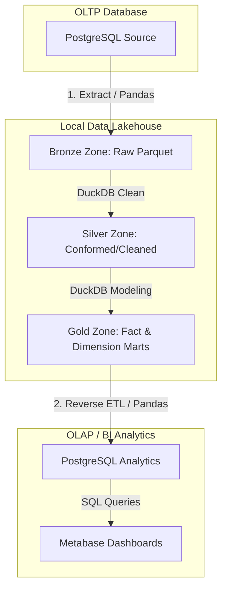

# Toy Store End-to-End Data Lakehouse Pipeline

Dự án này xây dựng một hệ thống **Data Lakehouse** hoàn chỉnh (End-to-End) phục vụ việc phân tích dữ liệu cho cửa hàng đồ chơi (**Toy Store**). 

Hệ thống tự động thu thập dữ liệu từ cơ sở dữ liệu giao dịch PostgreSQL (OLTP), lưu trữ dưới dạng hồ dữ liệu cục bộ (Local Data Lake) theo kiến trúc Medallion (Bronze -> Silver -> Gold), thực hiện các phép biến đổi SQL hiệu năng cao qua **DuckDB**, tự động điều phối qua **Apache Airflow**, và cuối cùng nạp ngược lại dữ liệu đã tổng hợp về PostgreSQL (Reverse ETL) để phục vụ trực quan hóa trên **Metabase**.

---

## 🗺️ Kiến trúc hệ thống (Medallion Architecture)



1. **PostgreSQL Source (OLTP)**: Lưu trữ các bảng staging giao dịch và hoạt động của Toy Store.
2. **Bronze Zone (Raw)**: Dữ liệu thô trích xuất nguyên bản từ Postgres sang định dạng file **Parquet** đặt tại `data/bronze/`.
3. **Silver Zone (Cleaned/Conformed)**: Dữ liệu được chuẩn hóa cột `created_at`, ép kiểu dữ liệu chuẩn, xử lý khoảng trắng và điền giá trị mặc định cho các trường null đặt tại `data/silver/`.
4. **Gold Zone (Business/Curated)**: Dữ liệu được tổ chức theo mô hình hình sao (Star Schema) gồm Fact, Dimension và các bảng báo cáo tổng hợp (Marts) đặt tại `data/gold/`.
5. **PostgreSQL Analytics (OLAP)**: Nhận dữ liệu tổng hợp từ tầng Gold phục vụ các truy vấn phân tích (Reverse ETL).
6. **Metabase**: Kết nối tới PostgreSQL để xây dựng báo cáo và Dashboard.
7. **Apache Airflow**: Điều phối tự động toàn bộ quy trình chạy tuần tự.

---

## 🛠️ Công nghệ sử dụng (Tech Stack)

* **Orchestrator**: Apache Airflow 3.x (chạy trong Docker Container)
* **Compute Engine**: DuckDB 1.x (xử lý dữ liệu in-memory hiệu năng cao trực tiếp trên file Parquet)
* **Database**: PostgreSQL 15 (chứa cả dữ liệu nguồn giao dịch và dữ liệu đích phân tích)
* **BI Tool**: Metabase
* **Language & Libraries**: Python 3.12, Pandas, SQLAlchemy, PyArrow

---

## 📁 Cấu trúc thư mục dự án

```text
toy_store_end_to_end/
├── dags/                    # Chứa Apache Airflow DAGs để điều phối pipeline
│   └── toy_store_lakehouse_dag.py
├── data/                    # Local Lakehouse chứa các tệp Parquet
│   ├── bronze/              # Dữ liệu thô (Raw Parquet)
│   ├── silver/              # Dữ liệu làm sạch (Cleaned Parquet)
│   └── gold/                # Dữ liệu tổng hợp phân tích (Star Schema Marts)
├── etls/                    # Scripts xử lý dữ liệu (Extract, Transform, Load)
│   ├── extract_postgres.py  # Trích xuất dữ liệu: Postgres -> Bronze
│   ├── transform_duckdb.py  # Biến đổi dữ liệu: Bronze -> Silver -> Gold bằng DuckDB
│   └── load_gold_to_postgres.py # Nạp dữ liệu: Gold -> Postgres (Reverse ETL)
├── utils/                   # Các tiện ích kết nối và cấu hình hệ thống
│   ├── db_connector.py      # Cung cấp SQLAlchemy engine kết nối database
│   ├── init_postgres_data.py # Khởi tạo bảng staging và nạp dữ liệu mẫu nguồn
│   └── inspect_db.py        # Tiện ích kiểm tra cấu trúc bảng database
├── tests/                   # Kiểm thử dữ liệu
│   └── test_data.py         # Kiểm tra nhanh schema file Parquet bằng DuckDB
├── Dockerfile               # Cấu hình đóng gói môi trường Airflow
├── docker-compose.yml       # Điều phối các container Airflow, Postgres, Metabase
├── airflow.env              # Biến môi trường của Airflow
└── requirements.txt         # Các thư viện Python phục vụ dự án
```

---

## 🚀 Hướng dẫn cài đặt và khởi chạy nhanh

### 1. Khởi động các dịch vụ bằng Docker Compose
Dự án được cấu hình để chạy toàn bộ các dịch vụ thông qua Docker Compose. Bạn chỉ cần chạy lệnh sau tại thư mục gốc:

```bash
docker-compose up --build -d
```

Lệnh này sẽ khởi chạy 3 container:
* **PostgreSQL** (`postgres_source_db`): Cổng `5432`
* **Apache Airflow** (`airflow_app_container`): Cổng `8080`
* **Metabase** (`metabase_container`): Cổng `3000`

### 2. Khởi tạo dữ liệu mẫu (Seeding)
Sau khi database PostgreSQL khởi chạy thành công, bạn cần tạo các bảng giao dịch nguồn và nạp dữ liệu thử nghiệm. Chạy script tiện ích sau ở môi trường cục bộ (hoặc chạy trực tiếp bên trong container Airflow):

```bash
# Cài đặt thư viện Python nếu chạy ở máy local
pip install -r requirements.txt

# Khởi tạo schema và nạp dữ liệu mẫu
python utils/init_postgres_data.py
```

Bạn có thể kiểm tra xem dữ liệu đã được tạo thành công trên PostgreSQL hay chưa bằng lệnh:
```bash
python utils/inspect_db.py
```

### 3. Vận hành Pipeline dữ liệu

#### Cách A: Chạy tự động qua Airflow Web UI (Khuyên dùng)
1. Truy cập giao diện quản trị Airflow tại địa chỉ: [http://localhost:8080](http://localhost:8080).
2. Tìm kiếm DAG có tên là `toy_store_lakehouse_pipeline`.
3. Bật (Toggle Active) DAG và nhấn nút **Trigger DAG** để bắt đầu chạy pipeline. Các tác vụ sẽ chạy tuần tự: trích xuất -> làm sạch -> tổng hợp -> nạp ngược lại database.

#### Cách B: Chạy thủ công từng bước qua dòng lệnh
Nếu không muốn sử dụng Airflow, bạn có thể tự kích hoạt quy trình bằng cách chạy lần lượt các script Python sau:

```bash
# Bước 1: Trích xuất Postgres -> Bronze Parquet
python etls/extract_postgres.py

# Bước 2: Biến đổi dữ liệu Bronze -> Silver -> Gold qua DuckDB
python etls/transform_duckdb.py

# Bước 3: Nạp dữ liệu Gold Parquet ngược lại Postgres phục vụ BI
python etls/load_gold_to_postgres.py
```

### 4. Kết nối và xây dựng Dashboard trên Metabase
1. Truy cập Metabase tại địa chỉ: [http://localhost:3000](http://localhost:3000).
2. Tạo tài khoản quản trị ban đầu.
3. Thêm mới kết nối Database:
   * **Database type**: PostgreSQL
   * **Host**: `postgres-source` (nếu kết nối từ trong mạng Docker) hoặc `localhost` (nếu cấu hình từ bên ngoài)
   * **Port**: `5432`
   * **Database name**: `toy_store_db`
   * **Username**: `postgres`
   * **Password**: `nguyen`
4. Truy cập vào cơ sở dữ liệu để xem và vẽ biểu đồ từ các bảng phân tích tầng Gold đã được nạp:
   * `gold_fact_order_items`
   * `gold_dim_products`
   * `gold_dim_website_sessions`
   * `gold_mart_product_performance`
   * `gold_mart_session_conversion`

---

## 🧪 Kiểm thử dữ liệu (Data Testing)

Bạn có thể chạy thử tệp kiểm tra nhanh cấu trúc file Parquet thô được trích xuất bằng cách chạy:
```bash
python tests/test_data.py
```
Tệp tin sẽ hiển thị cấu trúc schema của bảng dữ liệu `orders` ở tầng Bronze cùng bản xem trước 5 bản ghi đầu tiên.